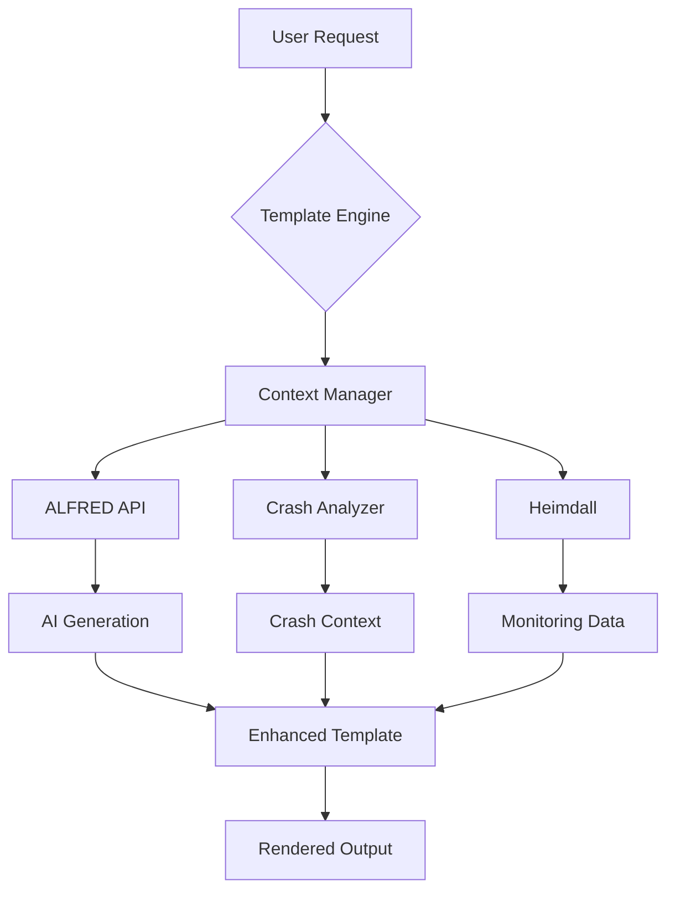

# Alexandria Templates Plugin - Implementation Guide

## Architecture Overview

The Alexandria Templates Plugin is designed as a first-class citizen in the Alexandria Platform ecosystem, deeply integrated with existing plugins and following Alexandria's design patterns.

## Key Integration Points

### 1. ALFRED Integration
- **AI-Powered Generation**: Templates can be generated on-demand using ALFRED's LLM capabilities
- **Context-Aware Suggestions**: ALFRED analyzes your codebase to suggest relevant templates
- **Learning Mode**: Templates improve based on team usage patterns

### 2. Crash Analyzer Integration
- **Auto-Template Creation**: Automatically generates crash report templates from log patterns
- **Root Cause Templates**: Creates investigation templates based on AI analysis
- **Solution Documentation**: Templates for documenting fixes and preventions

### 3. Heimdall Integration
- **Alert Templates**: Auto-generates monitoring alert formats
- **Dashboard Cards**: Creates visualization templates for metrics
- **Incident Response**: Templates for escalation and response procedures

## Plugin Communication

```typescript
// Example: Cross-plugin communication
const templatePlugin = await alexandria.getPlugin('alexandria-templates');
const alfredPlugin = await alexandria.getPlugin('alfred');

// Generate a template using ALFRED
const template = await templatePlugin.generateWithAlfred({
  prompt: "Create a React component for displaying crash statistics",
  context: {
    crashData: await crashAnalyzer.getRecentCrashes(),
    monitoring: await heimdall.getCurrentMetrics()
  }
});
```

## UI Integration

The plugin seamlessly integrates with Alexandria's VS Code-style interface:

1. **Activity Bar**: Dedicated icon with badge for template updates
2. **Explorer View**: Hierarchical template browser
3. **Command Palette**: Quick template commands (Cmd/Ctrl + K)
4. **Status Bar**: Template usage statistics
5. **Context Menus**: Right-click template insertion

## Data Flow

