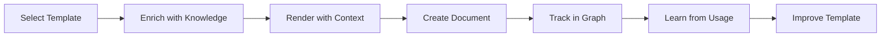

# Mnemosyne Templates & Snippets System - Complete Overview

## 🧠 What is Mnemosyne?

Mnemosyne is Alexandria Platform's **knowledge management and documentation plugin**, named after the Greek goddess of memory. It provides:
- Knowledge graph for document relationships
- Intelligent document management
- Team collaboration features
- AI-enhanced documentation workflows

The Templates & Snippets system is a **core feature within Mnemosyne**, not a separate plugin.

## 🎯 Purpose within Mnemosyne

The template system enhances Mnemosyne's knowledge management by:
1. **Standardizing Knowledge Creation** - Consistent document structures
2. **Accelerating Documentation** - Quick-start templates for common docs
3. **Preserving Organizational Knowledge** - Templates evolve with usage
4. **Enabling Knowledge Relationships** - Templates connect via knowledge graph

## 🔥 Key Integration Points

### 1. **Knowledge Graph Integration**
```typescript
// Templates are nodes in the knowledge graph
const template = await mnemosyne.knowledgeGraph.getNode(templateId, 'template');

// Templates track relationships
const relatedTemplates = await mnemosyne.knowledgeGraph.getRelated(templateId, {
  types: ['template', 'document'],
  depth: 2
});

// Usage creates connections
await mnemosyne.knowledgeGraph.recordUsage({
  type: 'template',
  id: templateId,
  usedIn: documentId
});
```

### 2. **Context-Aware Templates**
Templates automatically receive Mnemosyne context:
```handlebars
{{mnemosyne.id}}              <!-- Unique knowledge ID -->
{{mnemosyne.version}}          <!-- Document version -->
{{mnemosyne.related}}          <!-- Related documents -->
{{mnemosyne.prerequisites}}    <!-- Required reading -->
{{mnemosyne.learningPath}}     <!-- Suggested path -->
{{mnemosyne.collaborativeNotes}} <!-- Team notes -->
```

### 3. **ALFRED AI Enhancement**
```typescript
// Generate templates with knowledge context
const template = await engine.generateTemplate(
  "Create API documentation template",
  {
    knowledgeBase: mnemosyne.currentKnowledgeBase,
    relatedDocs: await mnemosyne.findSimilar(),
    userExpertise: mnemosyne.currentUser.expertise
  }
);
```

### 4. **Document Lifecycle**


## 📁 Architecture within Mnemosyne

```
mnemosyne/
├── src/features/templates/        # Template subsystem
│   ├── TemplateEngine.ts         # Core rendering with knowledge context
│   ├── TemplateRepository.ts     # Storage in knowledge base
│   ├── SnippetManager.ts         # Smart snippet handling
│   ├── AITemplateGenerator.ts    # ALFRED integration
│   └── ui/                       # Template UI components
├── knowledge-base/
│   └── templates/                # Template library
│       ├── documentation/        # Knowledge articles
│       ├── technical-specs/      # API docs, schemas
│       ├── meeting-notes/        # Intelligent meetings
│       └── collaboration/        # Team templates
```

## 🚀 Usage Scenarios

### 1. **Creating a Knowledge Article**
```typescript
// Mnemosyne suggests templates based on context
const suggestions = await mnemosyne.templates.suggest({
  documentType: 'knowledge-article',
  tags: ['api', 'authentication'],
  relatedTo: currentDocument
});

// Render with full knowledge context
const content = await mnemosyne.templates.render('knowledge-article', {
  title: 'OAuth 2.0 Implementation Guide',
  tags: ['security', 'api', 'authentication']
});
```

### 2. **API Documentation with Code Generation**
```handlebars
<!-- Template with ALFRED integration -->
{{#if alfred.codeExamples}}
  {{alfred.codeExamples}}
{{else}}
  <button onclick="generateWithAlfred()">
    Generate Examples with ALFRED
  </button>
{{/if}}
```

### 3. **Smart Meeting Notes**
- Auto-links to previous meetings
- Extracts action items to task system
- Connects decisions to documentation
- Tracks knowledge evolution

## 💡 Unique Mnemosyne Features

### 1. **Knowledge-Aware Variables**
```handlebars
{{mnemosyne.related}}        <!-- Related documents -->
{{mnemosyne.prerequisites}}  <!-- Required knowledge -->
{{mnemosyne.derived}}        <!-- Documents built on this -->
{{mnemosyne.learningPath}}   <!-- Suggested reading order -->
```

### 2. **Template Evolution**
Templates learn and improve:
- Track which sections are most edited
- Identify missing variables
- Suggest new sections based on usage
- Auto-update from successful documents

### 3. **Collaborative Intelligence**
```handlebars
{{#each mnemosyne.collaborativeNotes}}
  ### {{this.author}} - {{this.timestamp}}
  {{this.note}}
  References: {{#each this.references}}[{{@index}}]({{this}}){{/each}}
{{/each}}
```

### 4. **Knowledge Graph Queries**
```handlebars
<!-- Embed live queries in templates -->
```mnemosyne-query
SELECT * FROM knowledge_base
WHERE tags CONTAINS '{{topic}}'
AND created > '{{dateRange}}'
ORDER BY relevance DESC
```
```

## 🎨 UI Integration

### In Mnemosyne Explorer
- Templates appear in the knowledge tree
- Right-click → "Create from Template"
- Smart suggestions based on selection

### Command Palette (Cmd+K)
- `Mnemosyne: Create from Template`
- `Mnemosyne: Generate Template with ALFRED`
- `Mnemosyne: Insert Snippet`
- `Mnemosyne: Search Templates by Knowledge`

### Template Panel
- Integrated in Mnemosyne's sidebar
- Shows relevant templates for active document
- Live preview with knowledge connections
- One-click generation with ALFRED

## 📊 Analytics & Learning

### Template Effectiveness
```typescript
// Track template success metrics
const stats = await mnemosyne.analytics.getTemplateStats(templateId);
// Returns: usage count, edit patterns, completion rate, user satisfaction
```

### Knowledge Impact
- Which templates create most referenced documents
- Template → Knowledge conversion rate
- Team adoption patterns
- Learning path effectiveness

## 🔒 Governance

### Template Approval Workflow
1. Create/modify template
2. Peer review via Mnemosyne
3. Test with sample data
4. Approve for team use
5. Track effectiveness

### Version Control
- All templates versioned in knowledge graph
- Change history with reasoning
- Rollback capabilities
- A/B testing support

## 🌟 Best Practices

### 1. **Design for Knowledge Connections**
```handlebars
<!-- Always include relationship sections -->
## Related Knowledge
{{#each mnemosyne.related}}
- [{{this.title}}](mnemosyne://{{this.id}})
{{/each}}
```

### 2. **Enable Collaborative Enhancement**
```handlebars
<!-- Add collaborative sections -->
## Team Contributions
{{#if mnemosyne.allowCollaboration}}
  <!-- Team members can enhance this section -->
{{/if}}
```

### 3. **Leverage AI Assistance**
```handlebars
{{#if needsContent}}
  <button onclick="generateWithAlfred('{{context}}')">
    🧠 Generate with ALFRED
  </button>
{{/if}}
```

### 4. **Track Knowledge Evolution**
```handlebars
## Version History
{{#each mnemosyne.versions}}
- v{{version}}: {{changes}} by {{author}}
{{/each}}
```

## 🚦 Getting Started

1. **Access Templates**
   - Open Mnemosyne in Alexandria
   - Click Templates tab in sidebar
   - Or use Cmd+K → "Create from Template"

2. **Choose Template**
   - Browse by category
   - Search by knowledge connections
   - View AI suggestions

3. **Customize & Create**
   - Fill in variables
   - Let ALFRED generate sections
   - Preview with knowledge links

4. **Track & Improve**
   - Monitor usage analytics
   - Gather team feedback
   - Let templates evolve

## 🔮 Future Enhancements

1. **Predictive Templates** - AI predicts needed templates before you ask
2. **Cross-Plugin Templates** - Integrate with Crash Analyzer, Heimdall
3. **Template Marketplace** - Share templates across organizations
4. **Visual Template Builder** - Drag-drop template creation
5. **Smart Migrations** - Auto-update documents when templates change

---

The Templates & Snippets system transforms Mnemosyne from a simple documentation tool into an intelligent knowledge creation platform, where every document contributes to organizational learning and templates evolve to capture best practices.