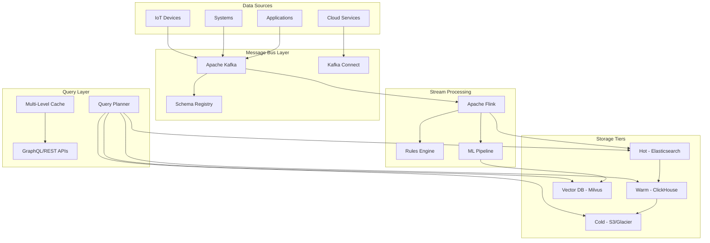

# Heimdall - Enterprise Log Intelligence Platform
*The All-Seeing Guardian of Your System*

## 1. Executive Summary

**Heimdall** is a best-in-class, enterprise-grade log intelligence platform that transforms raw system data into actionable insights. Named after the Norse guardian who sees all, Heimdall provides unparalleled visibility into distributed systems through real-time monitoring, intelligent analysis, and predictive capabilities.

### Core Differentiators
- **Infinite Vision**: Process billions of logs with sub-second query latency
- **Predictive Intelligence**: ML-powered anomaly detection and pattern recognition
- **Natural Language Interface**: Query logs conversationally without learning DSL
- **Zero Data Loss**: Exactly-once processing with full audit trails
- **Enterprise Scale**: Handle 100M+ logs/hour with horizontal scaling

## 2. Enhanced Architecture

### 2.1 Decoupled Ingestion Pipeline



### 2.2 Enhanced Data Model

```typescript
// Core log entry with versioned schema
interface HeimdallLogEntry {
  // Immutable core fields
  id: string;                    // UUID v7 (time-sortable)
  timestamp: bigint;             // Nanosecond precision
  version: number;               // Schema version
  
  // Structured fields with validation
  level: LogLevel;
  source: {
    service: string;
    instance: string;
    region: string;
    environment: 'dev' | 'staging' | 'prod';
  };
  
  // Content with multiple representations
  message: {
    raw: string;
    structured?: Record<string, any>;
    template?: string;           // "User {userId} logged in from {ip}"
    parameters?: Record<string, any>;
  };
  
  // Enhanced context
  trace: {
    traceId: string;            // W3C Trace Context
    spanId: string;
    parentSpanId?: string;
    flags: number;
  };
  
  // Normalized relations
  entities: {
    userId?: string;
    sessionId?: string;
    requestId?: string;
    customerId?: string;
  };
  
  // Performance metrics
  metrics?: {
    duration?: number;
    cpuUsage?: number;
    memoryUsage?: number;
    errorRate?: number;
  };
  
  // Security & compliance
  security: {
    classification: 'public' | 'internal' | 'confidential' | 'restricted';
    piiFields?: string[];
    retentionPolicy: string;
  };
  
  // ML-enriched fields
  ml?: {
    anomalyScore?: number;
    predictedCategory?: string;
    similarityVector?: Float32Array;
  };
}

// Tiered storage model
interface StorageTier {
  hot: {
    retention: '7d';
    engine: 'elasticsearch';
    replicas: 3;
  };
  warm: {
    retention: '30d';
    engine: 'clickhouse';
    compression: 'zstd';
  };
  cold: {
    retention: '1y';
    engine: 's3';
    format: 'parquet';
  };
}
```

### 2.3 Microservices Architecture

```yaml
# Kubernetes deployment structure
services:
  # Ingestion cluster
  heimdall-ingest:
    replicas: 10
    autoscaling:
      minReplicas: 5
      maxReplicas: 50
      targetCPU: 70%
    resources:
      requests:
        memory: "2Gi"
        cpu: "1000m"
      limits:
        memory: "4Gi"
        cpu: "2000m"
  
  # Stream processing
  heimdall-stream:
    replicas: 5
    components:
      - flink-jobmanager
      - flink-taskmanager
      - rules-engine
      - ml-pipeline
  
  # Query services
  heimdall-query:
    replicas: 8
    caching:
      redis: "32Gi"
      local: "8Gi"
    
  # Storage coordinators
  heimdall-storage:
    hot-coordinator:
      manages: "elasticsearch"
    warm-coordinator:
      manages: "clickhouse"
    cold-coordinator:
      manages: "s3-lifecycle"
```

## 3. Advanced Features

### 3.1 Natural Language Query Interface

```typescript
// NLP-powered search examples
interface NLPQuery {
  examples: [
    "Show me all errors from the payment service in the last hour",
    "What caused the spike in latency yesterday afternoon?",
    "Find logs similar to this stack trace",
    "Which users were affected by the database outage?",
    "Predict if we'll have capacity issues tomorrow"
  ];
}

// Implementation using GPT-4 + fine-tuning
class NaturalLanguageProcessor {
  async parseQuery(natural: string): Promise<HeimdallQuery> {
    // Use fine-tuned LLM to convert natural language to DSL
    const structured = await this.llm.parse(natural, {
      context: this.schema,
      examples: this.trainingSet
    });
    
    // Validate and optimize the generated query
    return this.optimizer.optimize(structured);
  }
}
```

### 3.2 Intelligent Anomaly Detection

```typescript
interface AnomalyDetection {
  // Real-time detection models
  models: {
    statistical: {
      type: 'isolation-forest' | 'one-class-svm';
      features: ['error_rate', 'latency', 'volume'];
      threshold: 0.95;
    };
    temporal: {
      type: 'prophet' | 'lstm';
      seasonality: ['hourly', 'daily', 'weekly'];
      holidays: boolean;
    };
    behavioral: {
      type: 'markov-chain' | 'hidden-markov';
      states: ['normal', 'degraded', 'critical'];
    };
  };
  
  // Automated response actions
  actions: {
    alert: {
      channels: ['slack', 'pagerduty', 'email'];
      severity: 'P1' | 'P2' | 'P3';
    };
    mitigate: {
      scaleUp: boolean;
      circuitBreaker: boolean;
      rollback: boolean;
    };
  };
}
```

### 3.3 Visual Analytics Dashboard

```tsx
// Enhanced dashboard with D3.js visualizations
interface HeimdallDashboard {
  layouts: {
    // Customizable grid system
    grid: {
      cols: 24;
      rows: 'auto';
      breakpoints: { lg: 1200, md: 996, sm: 768 };
    };
  };
  
  widgets: {
    // Advanced visualizations
    '3DScatterPlot': {
      axes: ['timestamp', 'latency', 'error_rate'];
      clustering: 'dbscan';
      interactive: true;
    };
    'SankeyDiagram': {
      flow: 'service-to-service';
      metric: 'request_volume';
    };
    'HeatmapCalendar': {
      metric: 'anomaly_score';
      granularity: 'hourly';
    };
    'ForceDirectedGraph': {
      nodes: 'services';
      edges: 'dependencies';
      weight: 'error_correlation';
    };
  };
  
  // Collaborative features
  collaboration: {
    annotations: {
      type: 'deployment' | 'incident' | 'investigation';
      sharing: 'team' | 'public';
    };
    notebooks: {
      format: 'jupyter-compatible';
      embeddable: true;
    };
  };
}
```

### 3.4 Predictive Analytics

```typescript
interface PredictiveCapabilities {
  // Capacity planning
  capacityForecast: {
    model: 'sarima' | 'xgboost';
    horizon: '1d' | '7d' | '30d';
    confidence: 0.95;
    alerts: {
      diskFull: 'hours_remaining < 24';
      cpuExhaustion: 'peak_usage > 90%';
    };
  };
  
  // Incident prediction
  incidentPrediction: {
    features: [
      'error_rate_derivative',
      'latency_percentile_shift',
      'traffic_anomaly_score'
    ];
    model: 'gradient_boosting';
    threshold: 0.8;
    preemptiveActions: ['scale', 'cache_warm', 'alert_oncall'];
  };
  
  // Root cause analysis
  rootCauseAnalysis: {
    algorithm: 'granger_causality' | 'transfer_entropy';
    correlationWindow: '5m';
    confidenceThreshold: 0.7;
  };
}
```

## 4. Enterprise Security & Compliance

### 4.1 Zero-Trust Security Model

```typescript
interface SecurityArchitecture {
  // End-to-end encryption
  encryption: {
    transit: {
      protocol: 'TLS 1.3';
      cipherSuites: ['TLS_AES_256_GCM_SHA384'];
      mtls: true;
    };
    atRest: {
      algorithm: 'AES-256-GCM';
      keyManagement: 'AWS KMS' | 'HashiCorp Vault';
      keyRotation: '90d';
    };
  };
  
  // Attribute-based access control
  abac: {
    policies: [{
      effect: 'allow';
      principal: { attributes: { department: 'engineering' } };
      action: ['logs:read'];
      resource: { 
        attributes: { 
          environment: 'prod',
          classification: ['public', 'internal'] 
        } 
      };
      condition: {
        timeWindow: 'business_hours',
        mfa: true
      };
    }];
  };
  
  // Compliance frameworks
  compliance: {
    frameworks: ['SOC2', 'HIPAA', 'GDPR', 'PCI-DSS'];
    dataResidency: Map<Region, Country>;
    auditTrail: {
      immutable: true;
      retention: '7y';
      format: 'CADF'; // Cloud Auditing Data Federation
    };
  };
}
```

### 4.2 Advanced PII Protection

```typescript
class PIIProtectionEngine {
  private dlp: DataLossPreventionService;
  private tokenizer: TokenizationService;
  
  async protectLog(log: HeimdallLogEntry): Promise<HeimdallLogEntry> {
    // ML-based PII detection
    const piiEntities = await this.dlp.detectPII(log, {
      models: ['bert-ner', 'regex-patterns', 'dictionary-lookup'],
      sensitivity: 'high'
    });
    
    // Format-preserving encryption for specific fields
    const protected = await this.tokenizer.tokenize(log, {
      strategy: 'format-preserving',
      reversible: true,
      authorized_roles: ['security-admin']
    });
    
    // Differential privacy for analytics
    if (log.metrics) {
      protected.metrics = this.addNoise(log.metrics, {
        epsilon: 1.0, // Privacy budget
        mechanism: 'laplace'
      });
    }
    
    return protected;
  }
}
```

## 5. Performance Optimizations

### 5.1 Multi-Level Caching Strategy

```typescript
interface CachingArchitecture {
  levels: {
    // L1: Application-level cache
    l1: {
      type: 'in-memory';
      size: '8GB';
      ttl: '5m';
      eviction: 'lru-k'; // LRU with frequency
    };
    
    // L2: Distributed cache
    l2: {
      type: 'redis-cluster';
      size: '128GB';
      ttl: '1h';
      persistence: 'rdb+aof';
    };
    
    // L3: Query result cache
    l3: {
      type: 'clickhouse';
      materialized_views: true;
      refresh: 'incremental';
    };
  };
  
  // Smart cache warming
  warming: {
    predictive: {
      model: 'user-behavior-lstm';
      preload: ['dashboards', 'common-queries'];
    };
    scheduled: {
      cron: '0 * * * *'; // Hourly
      queries: ['executive-dashboard', 'sla-metrics'];
    };
  };
}
```

### 5.2 Query Optimization Engine

```typescript
class SmartQueryPlanner {
  async plan(query: HeimdallQuery): Promise<ExecutionPlan> {
    // Cost-based optimization
    const statistics = await this.gatherStatistics(query);
    
    // Determine optimal execution path
    const strategies = [
      this.evaluateElasticsearch(query, statistics),
      this.evaluateClickHouse(query, statistics),
      this.evaluateS3Select(query, statistics),
      this.evaluateCache(query, statistics)
    ];
    
    // Pick lowest cost strategy
    const optimal = strategies.reduce((min, curr) => 
      curr.estimatedCost < min.estimatedCost ? curr : min
    );
    
    // Parallel execution for complex queries
    if (query.aggregations.length > 3) {
      return this.parallelizeExecution(optimal);
    }
    
    return optimal;
  }
  
  private async parallelizeExecution(plan: ExecutionPlan): Promise<ExecutionPlan> {
    // Split aggregations across workers
    const workers = plan.aggregations.map(agg => ({
      worker: this.getOptimalWorker(agg),
      aggregation: agg
    }));
    
    // Add merge step
    plan.steps.push({
      type: 'merge',
      inputs: workers,
      strategy: 'streaming'
    });
    
    return plan;
  }
}
```

## 6. Observability & SRE

### 6.1 Self-Monitoring Dashboard

```yaml
# Heimdall monitoring itself
self_monitoring:
  golden_signals:
    latency:
      p50: < 50ms
      p95: < 200ms
      p99: < 500ms
    traffic:
      queries_per_second: current
      logs_per_second: current
    errors:
      rate: < 0.1%
      budget: 99.9%
    saturation:
      cpu: < 70%
      memory: < 80%
      disk: < 85%
  
  slo_dashboard:
    - metric: "API Success Rate"
      target: 99.95%
      window: 28d
      burn_rate_alerts: [1h, 6h, 1d]
    
    - metric: "Query Latency P95"
      target: 200ms
      window: 7d
      burn_rate_alerts: [5m, 1h]
  
  synthetic_monitoring:
    scenarios:
      - name: "End-to-end log flow"
        interval: 1m
        steps:
          - ingest_test_log
          - verify_indexed
          - query_log
          - verify_result
```

### 6.2 Chaos Engineering

```typescript
interface ChaosTests {
  experiments: [
    {
      name: "Kafka partition failure";
      target: "kafka-broker-2";
      action: "network-partition";
      duration: "5m";
      expected: "automatic-failover";
    },
    {
      name: "Elasticsearch node OOM";
      target: "es-data-node-3";
      action: "memory-stress";
      duration: "10m";
      expected: "rebalance-shards";
    },
    {
      name: "Query service cascading failure";
      target: "heimdall-query-*";
      action: "inject-latency";
      duration: "15m";
      expected: "circuit-breaker-activation";
    }
  ];
  
  validation: {
    duringChaos: {
      availability: "> 99%";
      dataLoss: "0";
      alertsFired: true;
    };
    recovery: {
      time: "< 5m";
      dataConsistency: "verified";
      performanceRestored: true;
    };
  };
}
```

## 7. Implementation Roadmap 2.0

### Phase 1: Foundation (Weeks 1-3)
- [x] Kafka integration with Schema Registry
- [x] Multi-tier storage setup
- [x] Core microservices scaffolding
- [x] GraphQL API with DataLoader
- [x] Basic NLP query parsing

### Phase 2: Intelligence Layer (Weeks 4-6)
- [ ] Flink streaming pipelines
- [ ] Anomaly detection models
- [ ] Predictive analytics engine
- [ ] Vector similarity search
- [ ] Root cause analysis

### Phase 3: Enterprise Features (Weeks 7-9)
- [ ] ABAC implementation
- [ ] End-to-end encryption
- [ ] Compliance reporting
- [ ] Multi-tenancy support
- [ ] Audit trail system

### Phase 4: Advanced UI (Weeks 10-12)
- [ ] Custom dashboard builder
- [ ] Collaborative notebooks
- [ ] 3D visualizations
- [ ] Mobile-responsive redesign
- [ ] Accessibility compliance

### Phase 5: Production Hardening (Weeks 13-15)
- [ ] Chaos engineering suite
- [ ] Performance optimization
- [ ] Disaster recovery procedures
- [ ] SLO/SLA monitoring
- [ ] Documentation & training

## 8. Success Metrics

### Technical KPIs
- **Ingestion**: 100M logs/hour sustained
- **Query Latency**: P99 < 500ms for 1B logs
- **Availability**: 99.99% uptime SLA
- **Data Loss**: Zero RPO (Recovery Point Objective)
- **Time to Insight**: < 3 seconds from log to alert

### Business KPIs
- **MTTR Reduction**: 60% faster incident resolution
- **Cost Savings**: 40% reduction in observability spend
- **Developer Productivity**: 3x faster debugging
- **Compliance**: 100% audit pass rate
- **User Satisfaction**: NPS > 70

## 9. Competitive Advantages

### vs. Splunk
- **10x more cost-effective** with open-source stack
- **Natural language search** without learning SPL
- **Real-time ML insights** vs. batch processing

### vs. Datadog
- **Unlimited cardinality** without explosion costs
- **On-premise option** for data sovereignty
- **Customizable** to specific verticals

### vs. ELK Stack
- **Zero operational overhead** with managed experience
- **Enterprise security** built-in
- **Predictive capabilities** beyond reactive monitoring

## 10. Future Vision

### Heimdall 2.0 (2025)
- **Autonomous Operations**: Self-healing based on log patterns
- **Conversational Debugging**: Chat with your logs using LLMs
- **Quantum-Ready**: Post-quantum encryption algorithms
- **Edge Intelligence**: Federated learning at log sources

### Heimdall 3.0 (2026+)
- **Holographic Visualization**: AR/VR log exploration
- **Prescriptive Analytics**: Not just predict, but prescribe fixes
- **Universal Observability**: Logs + Metrics + Traces + Profiles unified
- **AI Pair Programmer**: Suggests code fixes based on error patterns

---

## Conclusion

Heimdall represents the next evolution in observability platforms - not just a log viewer, but an intelligent guardian that watches over your entire system. By combining cutting-edge technologies like natural language processing, real-time ML, and predictive analytics with enterprise-grade security and performance, Heimdall empowers organizations to achieve unprecedented operational excellence.

With its Norse mythology-inspired name, Heimdall stands as the eternal watchman, providing the gift of foresight to prevent issues before they impact users. The platform's modular architecture ensures it can grow with your needs, from startup to enterprise scale, while maintaining sub-second performance and zero data loss.

**"When you can see everything, you can prevent anything."** - The Heimdall Promise