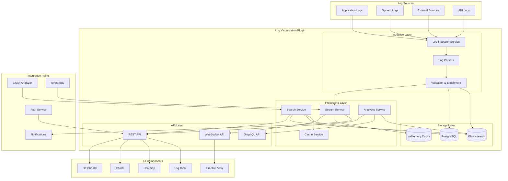
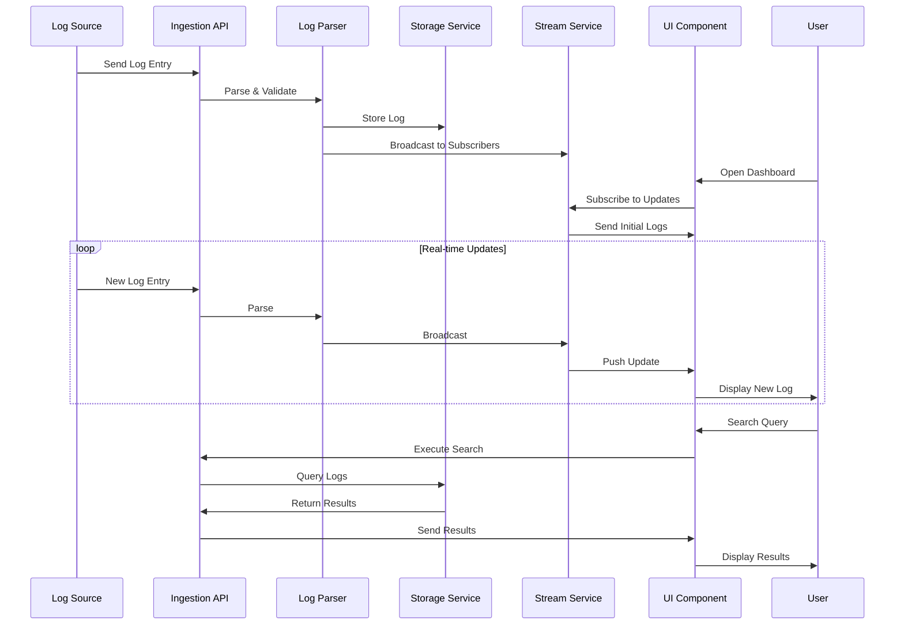
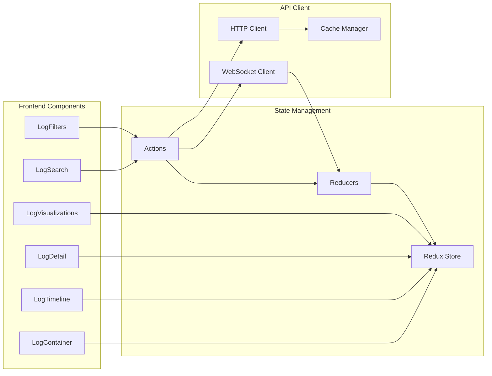
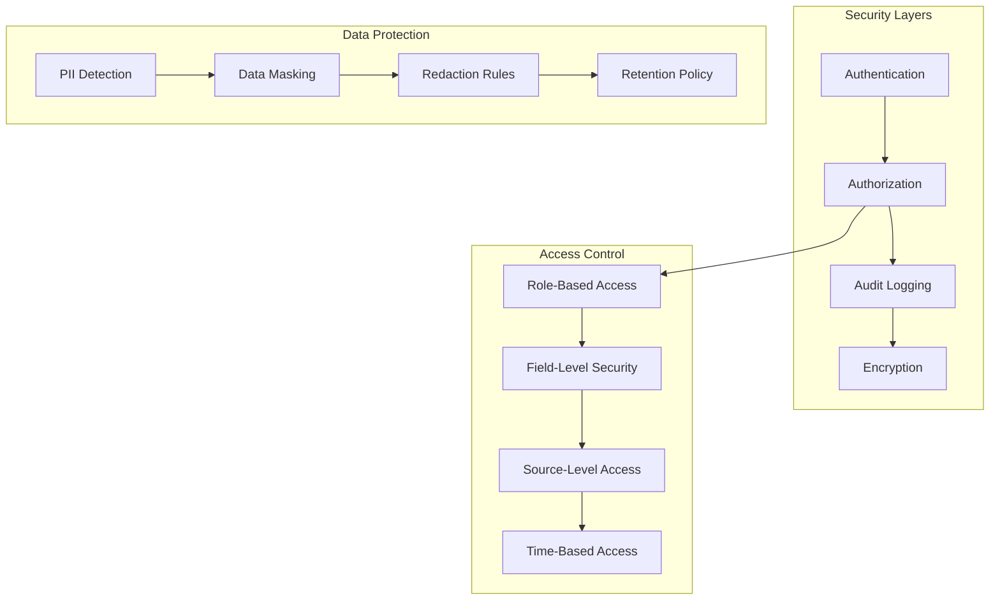
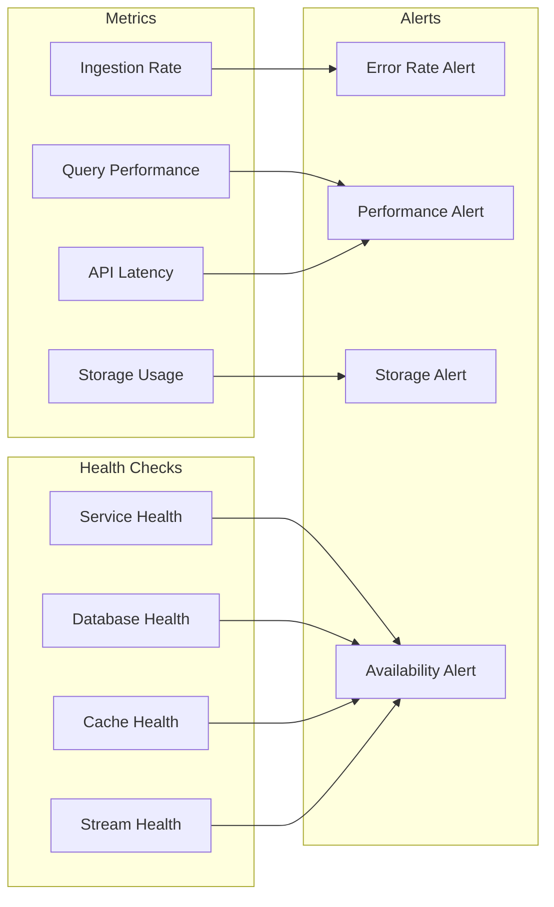

# Log Visualization Plugin - Architecture Diagrams

## System Architecture



## Data Flow Diagram



## Component Interaction Diagram



## Database Schema

```sql
-- Main log entry table
CREATE TABLE log_entries (
    id UUID PRIMARY KEY DEFAULT gen_random_uuid(),
    timestamp TIMESTAMPTZ NOT NULL,
    level VARCHAR(10) NOT NULL,
    source VARCHAR(255) NOT NULL,
    message TEXT NOT NULL,
    metadata JSONB,
    context JSONB,
    tags TEXT[],
    fingerprint VARCHAR(64),
    created_at TIMESTAMPTZ DEFAULT NOW(),
    
    -- Indexes for performance
    INDEX idx_timestamp (timestamp DESC),
    INDEX idx_level (level),
    INDEX idx_source (source),
    INDEX idx_fingerprint (fingerprint),
    INDEX idx_metadata_gin (metadata) USING GIN,
    INDEX idx_tags_gin (tags) USING GIN
);

-- Saved searches
CREATE TABLE saved_searches (
    id UUID PRIMARY KEY DEFAULT gen_random_uuid(),
    user_id UUID NOT NULL,
    name VARCHAR(255) NOT NULL,
    query JSONB NOT NULL,
    is_public BOOLEAN DEFAULT FALSE,
    created_at TIMESTAMPTZ DEFAULT NOW(),
    updated_at TIMESTAMPTZ DEFAULT NOW()
);

-- Log sources configuration
CREATE TABLE log_sources (
    id UUID PRIMARY KEY DEFAULT gen_random_uuid(),
    name VARCHAR(255) NOT NULL,
    type VARCHAR(50) NOT NULL,
    config JSONB NOT NULL,
    enabled BOOLEAN DEFAULT TRUE,
    last_seen TIMESTAMPTZ,
    created_at TIMESTAMPTZ DEFAULT NOW()
);

-- Analytics cache
CREATE TABLE analytics_cache (
    id UUID PRIMARY KEY DEFAULT gen_random_uuid(),
    query_hash VARCHAR(64) NOT NULL,
    result JSONB NOT NULL,
    expires_at TIMESTAMPTZ NOT NULL,
    created_at TIMESTAMPTZ DEFAULT NOW(),
    
    INDEX idx_query_hash (query_hash),
    INDEX idx_expires_at (expires_at)
);
```

## API Request/Response Flow

```yaml
# Search Request
POST /api/plugins/log-visualization/search
{
  "timeRange": {
    "from": "2024-01-06T00:00:00Z",
    "to": "2024-01-06T23:59:59Z"
  },
  "query": "error AND service:api",
  "filters": [
    {
      "field": "level",
      "operator": "in",
      "values": ["ERROR", "FATAL"]
    }
  ],
  "aggregations": [
    {
      "type": "date_histogram",
      "field": "timestamp",
      "interval": "1h"
    }
  ],
  "limit": 100,
  "sort": {
    "field": "timestamp",
    "order": "desc"
  }
}

# Search Response
{
  "data": {
    "logs": [
      {
        "id": "550e8400-e29b-41d4-a716-446655440000",
        "timestamp": "2024-01-06T15:30:00Z",
        "level": "ERROR",
        "source": "api-gateway",
        "message": "Failed to process request",
        "metadata": {
          "service": "api",
          "userId": "user123",
          "traceId": "trace456"
        }
      }
    ],
    "aggregations": {
      "date_histogram": [
        {
          "key": "2024-01-06T00:00:00Z",
          "count": 45
        },
        {
          "key": "2024-01-06T01:00:00Z",
          "count": 52
        }
      ]
    },
    "total": 1523,
    "took": 125
  }
}
```

## Performance Optimization Strategy

```mermaid
graph TD
    subgraph "Query Optimization"
        Q1[Query Parser]
        Q2[Query Planner]
        Q3[Query Cache]
        Q4[Query Executor]
    end
    
    subgraph "Storage Optimization"
        S1[Time-based Partitioning]
        S2[Index Management]
        S3[Data Compression]
        S4[Archive Strategy]
    end
    
    subgraph "Real-time Optimization"
        R1[Buffer Management]
        R2[Batch Processing]
        R3[Connection Pooling]
        R4[Circuit Breaker]
    end
    
    Q1 --> Q2
    Q2 --> Q3
    Q3 --> Q4
    
    S1 --> S2
    S2 --> S3
    S3 --> S4
    
    R1 --> R2
    R2 --> R3
    R3 --> R4
```



## Security Architecture



## Deployment Architecture

```yaml
# Docker Compose Configuration
version: '3.8'

services:
  log-visualization:
    image: alexandria/log-visualization:latest
    environment:
      - NODE_ENV=production
      - DB_CONNECTION_STRING=${DB_CONNECTION_STRING}
      - ELASTICSEARCH_URL=${ELASTICSEARCH_URL}
      - REDIS_URL=${REDIS_URL}
    ports:
      - "4001:4001"
    depends_on:
      - postgres
      - elasticsearch
      - redis
    
  postgres:
    image: postgres:15
    environment:
      - POSTGRES_DB=logs
      - POSTGRES_USER=loguser
      - POSTGRES_PASSWORD=${DB_PASSWORD}
    volumes:
      - postgres_data:/var/lib/postgresql/data
    
  elasticsearch:
    image: elasticsearch:8.11.0
    environment:
      - discovery.type=single-node
      - xpack.security.enabled=false
    volumes:
      - es_data:/usr/share/elasticsearch/data
    
  redis:
    image: redis:7
    volumes:
      - redis_data:/data

volumes:
  postgres_data:
  es_data:
  redis_data:
```

## Monitoring & Observability



This architecture provides a scalable, secure, and performant foundation for the Log Visualization Plugin, with clear separation of concerns and well-defined integration points.